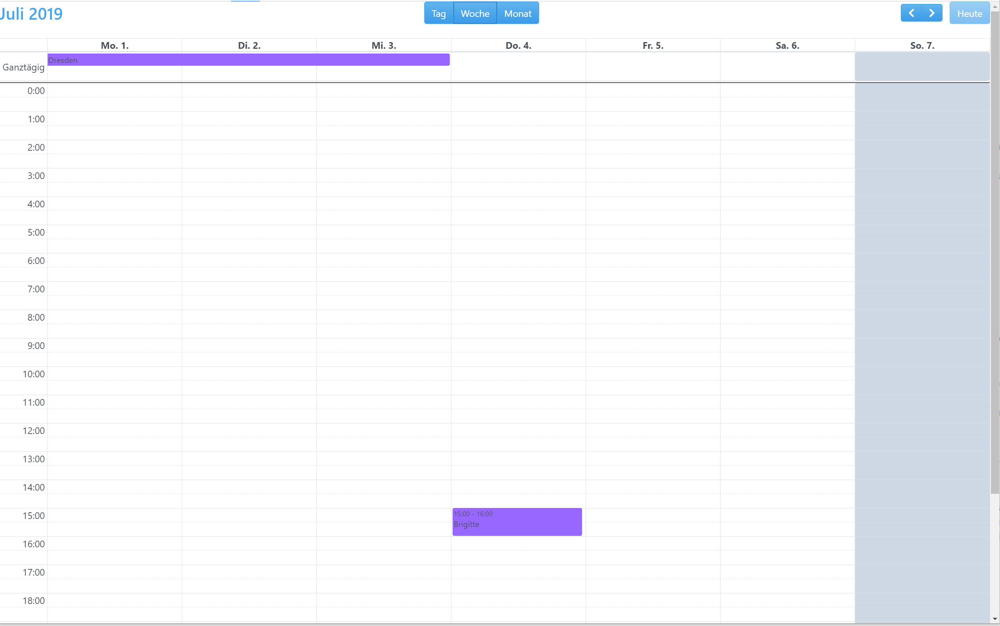
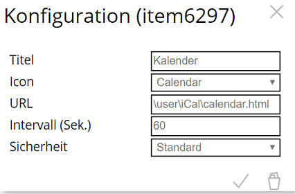

Kalender im WebFront anzeigen
===

In diesem Beispiel wird gezeigt, wie Kalenderdaten aus mehreren **iCalCalendarReader**-Instanzen in einem Kalender-Control im WebFront angezeigt werden können. Die Kalendereinträge haben für jeden Kalender eine unterschiedliche Farbe.

Grundlage für die Visualisierung ist das Kalender-Control [Full Calendar](https://fullcalendar.io/).

**Inhaltsverzeichnis**

1. [Funktionsumfang](#1-funktionsumfang)
2. [Voraussetzungen](#2-voraussetzungen)
3. [Installation](#3-installation)

### 1. Funktionsumfang

Ein umfangreiches Kalender-Control, das an die eigenen Wünsche angepasst werden kann (siehe [Dokumentation](https://fullcalendar.io/docs/)).  
Die Kalendereinträge sind in dieser Implementierung auf ID, Titel, Start-/Endzeitpunkt sowie ein Ganztages-Flag beschränkt.

**Beispielansicht in Symcon:**

### 2. Voraussetzungen

- Symcon ab Version 5.1
- Kalender im iCal-Format
- Installierte und lauffähige **iCalCalendarReader**-Instanzen

### 3. Installation

1. Kopiere die Dateien `calendar.html` und `feed.php` aus dem Verzeichnis `docs/Examples` (zu finden im Symcon-Programmverzeichnis unter `modules/.store/de.bumaas.ical`) in einen Unterordner deines User-Verzeichnisses (z. B. `/user/calendar`). Tipp: Das Programmverzeichnis lässt sich mit `echo IPS_GetKernelDir()` bestimmen.
2. Öffne die Datei `calendar.html` in einem Texteditor und nimm folgende Anpassungen vor:
  * **Instanz-IDs:** Suche im Array `eventSources` (ab Zeile 46) nach der Eigenschaft `InstanceID`. Ersetze den Platzhalter `12345` durch die ID deiner **iCalCalendarReader**-Instanz aus dem IP-Symcon Objektbaum.
  * **Weitere Quellen:** Du kannst das Objekt im Array beliebig oft duplizieren, um weitere Kalender (z. B. Abfallkalender, Feiertage) hinzuzufügen.
  * **Farben:** Pass die Eigenschaften `color` (Hintergrund) und `textColor` (Schriftfarbe) nach deinen Wünschen an (z. B. 'blue', '#FF0000').
3. Öffne den WebFront-Konfigurator in der IP-Symcon Management-Konsole.
4. Füge an beliebiger Stelle ein Element vom Typ **"Externe Seite"** hinzu.
5. Gib als URL den Pfad zu deiner Datei an: `/user/calendar/calendar.html`.

Wenn alles korrekt gelaufen ist, wird im WebFront nun ein Kalender-Control mit den Inhalten der angegebenen Kalender-Quellen angezeigt.  
Das Kalender-Control ist umfassend dokumentiert (siehe Abschnitt 1), es gibt hier noch genug Spielraum für Anpassungen.

Das Aussehen kann in `calendar.html` (ca. Zeile 23) angepasst werden. Standardmäßig wird das Theme `darkly` von [Bootswatch](https://bootswatch.com/) verwendet.  
Von Bootswatch gibt es auch eine Reihe weiterer Themes, die sich auf der Homepage ansehen lassen.

Um ein anderes Theme zu nutzen, ersetze einfach das Wort `darkly` im CSS-Link durch einen der folgenden Namen:
`cerulean, cosmo, cyborg, flatly, journal, litera, lumen, lux, materia, minty, pulse, sandstone, simplex, sketchy, slate, solar, spacelab, superhero, united, yeti`
