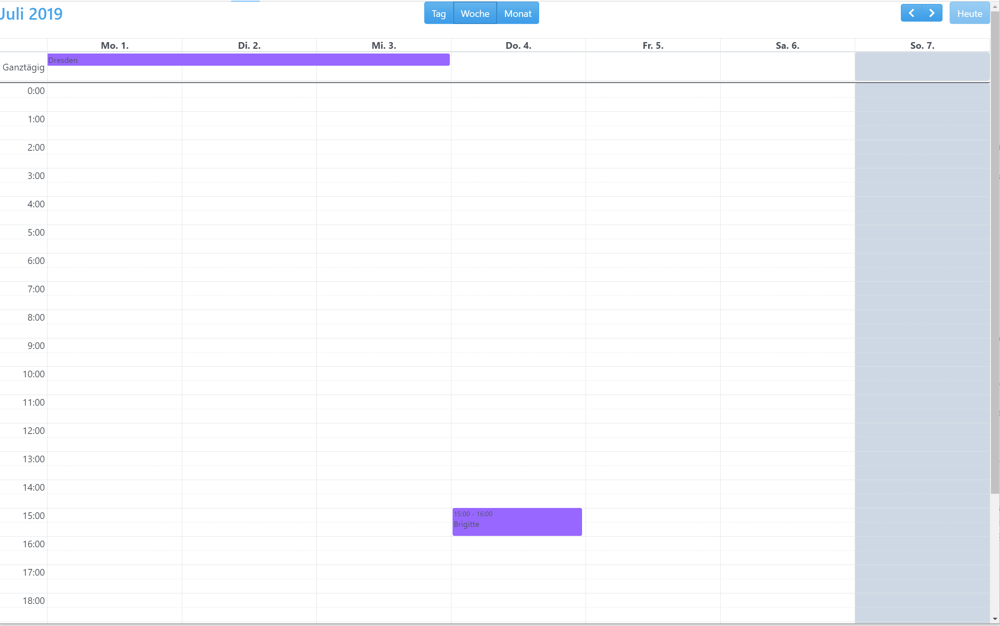
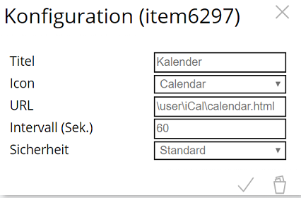

Kalender im Webfront anzeigen
===

In diesem Beispiel wird gezeigt, wie Kalenderdaten aus mehrerern **iCalCalendarReader**-Instanzen in einem Calendar-Control im Webfront angezeigt werden können. Die Kalendereinträge haben für jeden Kalender eine unterschiedliche Farbe.

Grundlage für die Visualisierung ist das Calendar-Control [Full Calendar](https://fullcalendar.io/)

**Inhaltverzeichnis**

1. [Funktionsumfang](#1-funktionsumfang)
2. [Voraussetzungen](#2-voraussetzungen)
3. [Installation](#3-installation)

### 1. Funktionsumfang

Umfangreiches Calendar-Control, das den eigenen Wünschen angepasst werden kann. Siehe hierzu die Dokumentation des Controls unter https://fullcalendar.io/docs/  
Kalendereinträge sind auf ID, Titel, Start- und Endzeitpunkt sowie ein Ganztages-Flag beschränkt.

Beispiel einer Ansicht in IP-Symcon:

### 2. Voraussetzungen

- IP-Symcon ab Version 5.1
- Kalender im iCal-Format
- Installierte und lauffähige **iCalCalendarReader**-Instanzen

### 3. Installation

* Die Dateien `calendar.html` und `feed.php` aus dem `iCal-Calendar\docs\Examples` Verzeichnis in ein Verzeichnis unterhalb des WebFront-User-Verzeichnisses `user` kopieren (z.B. `webfront\user\iCal`) .  
* In der Datei `calendar.html` händisch folgende Anpassungen vornehmen:
  * Ab Zeile 60 werden im Array `eventSources` beispielhaft zwei Kalenderquellen definiert. Hier müssen die Instanz-IDs mit gültigen Werten ersetzt werden. Hierfür die Instanz-IDs aus dem IP Symcon Objektbaum heraussuchen und innerhalb des Arrays `eventSources` im Objekt `extraParams` in die Property `InstanceID` eintragen.
  * Es können beliebig viele Quellen zu einem Kalender hinzugefügt werden, hier einfach analog zu den beiden Einträgen verfahren.
  * Die Farbeinstellungen `color` und `textColor` nach Gusto anpassen
* Im WebFront-Editor an beliebiger Position ein Element "Externe Seite" hinzufügen, mit der URL `/user/[Verzeichnisname]/calendar.html`.
  

Wenn alles korrekt gelaufen ist wird im WebFront nun ein Calendar Control mit den Inhalten der angegebenen Kalender-Quellen angezeigt.  

Die Calendar Control ist umfassend dokumentiert (siehe oben), es gibt hier noch genug Spielraum für Anpassungen.  

Das Theming kann in Zeile 23 angepasst werden. 
Standardmäßig wird die CSS `darkly` von [Bootswatch](https://bootswatch.com/) eingebunden.
Von Bootswatch gibt es auch Reihe weiterer Themes, die sich auf der Homepage auch ansehen lassen.

Für andere Themes dieser Seite kann einfach der Theme-Namen `darkly` im CSS-Pfad durch einen dieser Themenamen ersetzt werden:
cerulean, cosmo, cyborg, darkly, flatly, journal, litera, lumen, lux, materia, minty, pulse, sandstone, simplex, sketchy, slate, solar, spacelab, superhero, united oder yeti.
