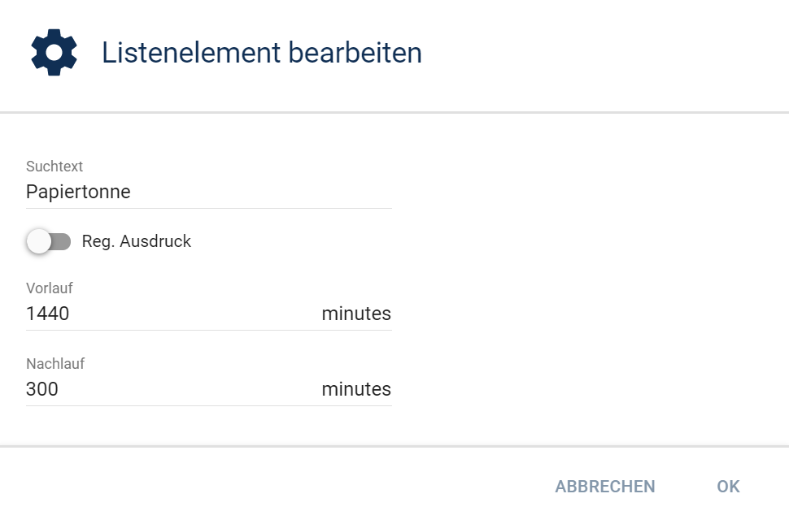
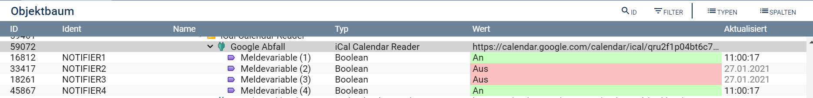

iCal Calendar in IP Symcon lesen und verarbeiten
===

Diese Bibliothek beinhaltet ein Modul zur Einspeisung von Kalenderinformationen im iCal-Format in IP Symcon:
* **iCal Calendar Reader**

**Inhaltverzeichnis**

1. [Funktionsumfang](#1-funktionsumfang)
2. [Voraussetzungen](#2-voraussetzungen)
3. [Software-Installation](#3-software-installation)
4. [Einrichten der Instanzen in IP-Symcon](#4-einrichten-der-instanzen-in-ip-symcon)
5. [Statusvariablen und Profile](#5-statusvariablen-und-profile)
6. [WebFront](#6-webfront)
7. [PHP-Befehlsreferenz](#7-php-befehlsreferenz)

### 1. Funktionsumfang

Das Modul dient dem Einlesen von Kalenderdaten in IP-Symcon (getestet mit Google Calendar, ownCloud Calendar, Synology Calendar und iCloud). Zum einen können die eingebundenen Kalender auf einfache Weise im Webfront angezeigt werden, zum anderen können eingetragene Termine zum Setzen von Statusvariablen ausgewertet werden.
Die eingelesenen Daten müssen [rfc5545](https://tools.ietf.org/html/rfc5545 "Internet Calendaring and Scheduling Core Object Specification") konform sein.

Damit ist es z.B. sehr einfach möglich einen zentralen Anwesenheitskalender im Internet zu pflegen, IP Symcon steuert damit automatisch Heizung, Alarmanlage und Anwesenheitssimulation.

Auch die Visualisierungen von Einträgen in öffentlichen Kalendern (z.B. Müllabfuhrtermine, Kinoprogramm, ...) im Webfront können ohne viel Skript-Programmierung realisiert werden. Z.B. können Abfuhrtermine immer bereits 1 Tag vorher angezeigt werden.

Kalender werden beim Laden unter Berücksichtigung ihrer jeweiligen Zeitzone in die lokale Zeitzone umgerechnet, sich wiederholende Termine werden als mehrere Einzeltermine abgespeichert.

Wie Kalenderdaten aus einer oder mehreren **iCalCalendarReader**-Instanzen in einem Calendar-Control im Webfront angezeigt werden können ist im Dokument [Kalender im Webfront anzeigen](docs/Examples/readme.md "Kalender im Webfront anzeigen") beschrieben.

Diese Bibliothek nutzt folgende externe Bibliotheken im Verzeichnis `/lib`:
* iCalcreator (Version 2.39.2) `https://github.com/iCalcreator/iCalcreator/tags`
* RRULE for PHP (Version 2.4.0 - 2023-02-22) `https://github.com/rlanvin/php-rrule`, MIT-Lizenz

### 2. Voraussetzungen

- IP-Symcon ab Version 5.1
- Kalender im iCal-Format

### 3. Software-Installation

Das Modul wird über den Modul Store installiert.

### 4. Einrichten der Instanzen in IP-Symcon

Unter "Instanz hinzufügen" eine Instanz **iCal Calendar Reader** hinzufügen.  

#### Konfigurationsseite:

| Eigenschaft                    | Typ     | Standardwert           | Beschreibung                                                                                                                                                                             |
|--------------------------------|---------|------------------------|------------------------------------------------------------------------------------------------------------------------------------------------------------------------------------------|
| active                         | boolean | true                   | aktiviert/deaktiviert die Instanz                                                                                                                                                        |
| CalendarServerURL              | string  |                        | URL zur iCal-Quelle                                                                                                                                                                      |
| Username                       | string  |                        | Benutzer für den Zugriff auf die Quelle                                                                                                                                                  |
| Password                       | string  |                        | Passwort dieses Benutzers                                                                                                                                                                |
| iCalMediaID                    | integer |                        | Id eines Media Objektes, welches eine Kalenderdatei enthält                                                                                                                              |
| DisableSSLVerifyPeer           | boolean | false                  | Deaktivierung der SSL Zertifikatsüberprüfung                                                                                                                                             |
| DaysToCache                    | integer | 30                     | Anzahl der Tage, für die Ereignisse in der Zukunft gelesen werden sollen                                                                                                                 |
| DaysToCacheBack                | integer | 30                     | Anzahl der Tage, für die Ereignisse in der Vergangenheit gelesen werden sollen                                                                                                           |
| UpdateFrequency                | integer | 15                     | Alle wieviel Minuten soll die Quelle gelesen werden                                                                                                                                      |
| WriteDebugInformationToLogfile | boolean | false                  | legt fest, ob die Debug Informationen zusätzlich in das Standard Logfile geschrieben werden sollen. <b>Wichtig:</b> dazu muss der Symcon Spezialschalter 'LogfileVerbose' aktiviert sein |
| <b>Notifiers</b>               ||
| Ident                          | string  | NOTIFIER + lfd. Nummer | Ident der Statusvariablen                                                                                                                                                                |
| Find                           | string  |                        | Suchmuster mit dem der Kalendereintrag verglichen wird                                                                                                                                   |    
| RegExpression                  | boolean | false                  | Kennzeichnung, ob es sich bei dem Suchmuster um einen regulären Ausdruck ("RegExpr") handelt                                                                                             |
| Prenotify                      | integer | 0                      | Wie viele Minuten vor dem Ereignisstart soll die Statusvariable auf "true" gesetzt werden                                                                                                |
| Postnotify                     | integer | 0                      | Wie viele Minuten nach dem Ereignisende soll die Statusvariable auf "true" gesetzt bleiben                                                                                               |

#### Einlesen des Kalenders über eine URL
Auf folgendes URL-Format ist bei den unterschiedlichen iCal-Servern zu achten:

**Google:**
`https://calendar.google.com/calendar/ical/(google-username)/private-(secret-hash-string)/basic.ics`  
Zu findem im Google Kalender. Im Hauptbildschirm rechts oben auf das Zahnrad klicken, dort *"Einstellungen"* auswählen. Im folgenden Bildschirm in der Kalenderliste links auf den zu importierenden Kalendernamen klicken. Es folgt ein neuer Bildschirm *"Kalendereinstellungen"*, dort in der Zeile *"Privatadresse im iCal-Format"* den angezeigten Link kopieren.  

**OwnCloud:**
`http[s]://(server-name)[:server-port]/remote.php/dav/calendars/(user-name)/(calendar-name)?export`  
Zu finden in der Kalender-App. Links in der Liste der Kalender auf *"..."* klicken, dann auf *"Link"*. Den erscheinenden Link kopieren und das Suffix `?export` anhängen.  

**Synology:**
`http[s]://(server-name)[:server-port]/caldav/(user-name)/(calendar.name)--(suffix)`  
Zu finden in der Calendar-App. Rechts in der Liste der Kalender das nach unten zeigende Dreieck neben dem Kalendernamen anklicken, *"CalDAV-Konto"* auswählen, in dem PopUp die Adresse für Thunderbird kopieren.  

**iCloud:**
`https://(server).icloud.com/published/(number)/(secret-hash-string-1)-(secret-hash-string-2)`  
Im macOS Kalender-Programm mit der rechten Maustaste auf den zu importierenden iCloud-Kalender klicken, *"Teilen"* auswählen und *"Öffentlicher Kalender"* auswählen. Den erscheinenden Link kopieren und das Protokoll `webcal` gegen `https` tauschen.
Alternativ kann der Link auch im Webportal https://www.icloud.com/#calendar durch Auswahl der Kalenderfreigabe des zu importierenden Kalenders ermittelt werden. Auch hier muss `webcal` gegen `https` ersetzt werden.   

#### Einlesen des Kalenders aus einer Datei
Für den Fall, dass eine vorliegende Kalenderdatei mit Terminen (z.B. eine iCal konforme Datei vom Abfallentsorger mit den Abholterminen) übernommen werden soll, so ist diese Datei zunächst in ein Medienobjekt vom Typ "Dokument" in Symcon zu übernehmen. Die Id der Medien Objekts ist dann in der Konfiguration anzugeben. 

Sobald eine URL bzw. eine Media-ID angegeben und gespeichert wurde, beginnt die Synchronisierung. Fehler beim Zugriff auf den Kalender stehen im Systemlog (Tabreiter **Meldungen** in der IP-Symcon Management Konsole). Bei jeder Änderung der Parameter wird eine sofortige Synchronisation und ein Update auf alle Meldevariablen gegeben.

#### Beispiel für Meldevariablen
Am Beispiel eines Müllkalenders soll die Vorgehensweise bei der Erstellung von Meldevariablen erläutert werden.

**Szenario:**   
*In einem Kalender gibt es Einträge für die Müllabholtermine. An den Müllabfuhrtagen soll - getrennt nach den Tonnenarten - eine entsprechende Statusvariable auf 'true' gesetzt werden.*

Die Einträge im Google Kalender lauten

Nun wird für jede zu erstellende Statusvariable ein Eintrag unter "Meldevariablen" angelegt. Im Beispiel soll eine Statusvariable für die Papiertonne erstellt werden. Wenn ein Kalendereintrag mit dem Begriff "Papiertonne" gefunden wird, dann soll die Statusvariable mit 24 Stunden Vorlauf (=1440 Minuten) und 5 Stunden Nachlauf auf "true" gesetzt werden.

Als Suchbegriff kann auch ein "Regulärer Ausdruck" verwendet werden. Zum Testen des Ausdrucks gibt es eine Testfunktion.

Es gibt aber auch im Web verschiedene Seiten (z.B. [regular expressions 101](https://regex101.com/)), die beim Ausformulieren von Suchmustern helfen.

Die gleiche Vorgehensweise gilt für die anderen Tonnen:

Nachdem die Instanz gesichert wurde, gibt es dann im Objektbaum die folgenden Variablen:

Die Statusvariablen können im Objektbaum zur besseren Übersicht nach Belieben umbenannt werden: .... 

### 5. Statusvariablen und Profile

Für jede in der Instanz angelegten Meldevariablen wird eine Statusvariable mit dem Ident 'NOTIFIER' und einer laufenden Nummer angelegt.
Die jeweilige Statusvariable zeigt an, ob ein Kalendereintrag unter Berücksichtigung der im Modul angegebenen Zeiten und des angegebenen Filters aktiv ist.

Es werden keine eigenen Variablenprofile angelegt.

### 6. WebFront

Die Meldevariablen sind mit Profilen für das WebFront vorbereitet.

### 7. PHP-Befehlsreferenz

`json_string ICCR_GetCachedCalendar(integer $InstanceID);`   
Gibt ein Array mit den zwischengespeicherten und in die lokale Zeitzone übertragenen Kalenderdaten als JSON-codierten String aus.

`void ICCR_TriggerNotifications(integer $InstanceID);`   
Forciert eine sofortige Überprüfung, ob die Statusvariablen aktualisiert werden müssen.
Diese Funktion wird intern jede Minute aufgerufen.  

`json_string ICCR_UpdateCalendar(integer $InstanceID);`   
Forciert eine sofortiges Neuladen des Kalenders.
Diese Funktion wird intern regelmäßig, wie in "Update-freq. (minutes)" konfiguriert, aufgerufen.
Gibt ein Array mit den zwischengespeicherten und in die lokale Zeitzone übertragenen Kalenderdaten als JSON-kodierten String aus. 
 
`json_string ICCR_GetNotifierPresenceReason(integer $InstanceID, string $ident);`   
Gibt ein Array der den Status bedingenden Ereignisse als JSON-kodierten String aus. 
